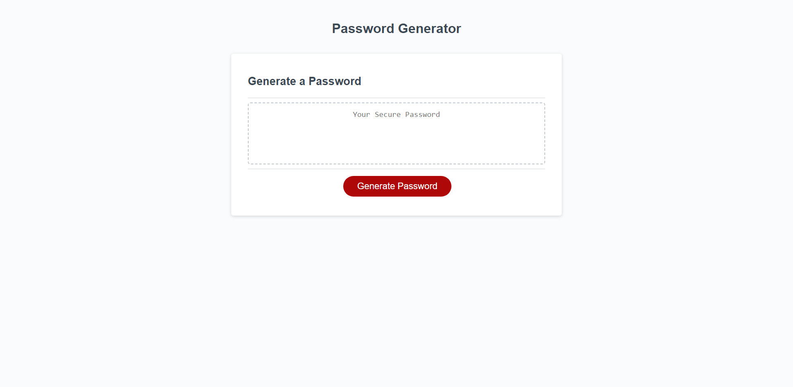

# JavaScript-Challenge

https://ryanthescholar.github.io/JavaScript-Challenge/

## Description

My motivation for this was to get a baseline of knowledge for Javascript, I built this project for people who want a random password. This solves a problem for people who can't think of a password. I learned more in-depth on for loops, Math.floor(), Math.random(). different methods for pushing, creating strings, concatenating arrays into an empty array or an existing array and much more, this is just to name a few of things I found notable.

## Table of Contents

- [Installation](#installation)
- [Usage](#usage)
- [Credits](#credits)
- [License](#license)

## Installation

N/A

## Usage

## Credits

N/A

## License

N/A

## Badges

## Features

it gives you free random passwords!!

## How to Contribute
    
Ryan.business.bowen@gmail.com

## Tests
